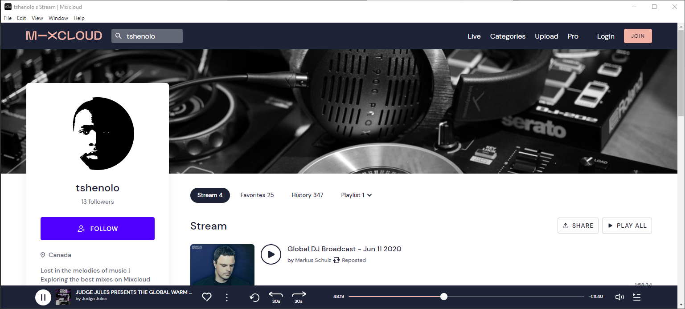

# 📻 Mixcloud Desktop App

The Mixcloud Desktop App is a cross-platform desktop application built with Electron.js that allows users to access and enjoy the Mixcloud platform directly from their desktop environment.

## Table of Contents

- [Introduction](#introduction)
- [Getting Started](#getting-started)
  - [Prerequisites](#prerequisites)
  - [Installation](#installation)
- [Usage](#usage)
- [Contribution](#contribution)
  - [Feature Requests](#feature-requests)
  - [Pull Requests](#pull-requests)
- [License](#license)

## Introduction

The Mixcloud Desktop App provides a dedicated desktop interface for Mixcloud, enabling users to access and enjoy their favorite music mixes, radio shows, and podcasts directly from their desktop. The application is built using Electron.js, which allows for the development of cross-platform desktop applications using web technologies such as HTML, CSS, and JavaScript.




## Getting Started

### Prerequisites

Before running the Mixcloud Desktop App, ensure that you have the following prerequisites installed on your system:

- Node.js (https://nodejs.org)
- npm (Node Package Manager)

### Installation

To install and run the Mixcloud Desktop App on your local machine, follow these steps:

1. Clone this repository to your local machine or download the source code as a ZIP file and extract it to a desired location.
    ```bash
    git clone https://github.com/tshenolo/mixcloud-desktop-app.git
    ```

2. Open your command-line interface and navigate to the project directory (`mixcloud` folder).
    ```bash
    cd mixcloud-desktop-app
    ```
    ```bash
    cd mixcloud
    ```

3. Install the project dependencies by running the following command:
   ```bash
   npm install
   ```

## Usage

To start using the Mixcloud Desktop App, you have two options:

### 1. Download the Pre-compiled Version (Windows)

If you're using Windows, you can download the pre-compiled version of the Mixcloud Desktop App in a zip format from the following [link](https://www.dropbox.com/s/3pnavstdjpwet87/mixcloud-win32-x64.zip?dl=0). Extract it to your desired location. Once extracted, simply run the `mixcloud.exe` file to launch the application.

### 2. Build and Run the Application (All Platforms)

If you prefer to build and run the application yourself, follow these steps:

1. Clone this repository to your local machine or download the source code as a ZIP file and extract it to a desired location.

2. Open your command-line interface and navigate to the project directory (`mixcloud` folder).

3. Install the project dependencies by running the following command:

   ```bash
   npm install
   ```
4. Run the following command to start the application:

   ```bash
   npm start
   ```

The Mixcloud Desktop App window will open, providing access to Mixcloud's content and features.


### 3. Packaging the Application  
If you wish to distribute your Mixcloud desktop app, Electron Packager can help you package it. Install Electron Packager as a development dependency by running:

    ```bash
    npm install electron-packager --save-dev
    ```

Next, update the "scripts" section in package.json as follows:

    ```json
    "scripts": {
    "start": "electron .",
    "package": "electron-packager . --platform=<platform> --arch=<arch> --out=dist --overwrite"
    }
    ```

Replace <platform> with your target platform (e.g., win32, darwin, or linux), and <arch> with the target architecture (e.g., x64 or arm64). You can specify multiple platforms and architectures separated by commas if needed.

To package the application, run the following command:

    ```bash
    npm run package
    ```

The packaged application files will be placed in the dist directory.

Choose the option that works best for you and start enjoying your favorite music mixes, radio shows, and podcasts directly from your desktop using the Mixcloud Desktop App!

  
## Contribution
Contributions to the Mixcloud Desktop App project are welcome. Please read the [Contribution Guidelines](CONTRIBUTING.md) for detailed information on how to contribute.

## Feature Requests
If you have any feature requests or ideas to enhance the Mixcloud Desktop App, please submit them by opening an issue on the GitHub repository. We appreciate your valuable feedback and suggestions.

## Pull Requests
If you would like to contribute directly to the development of the Mixcloud Desktop App, you can do so by opening a pull request. Please ensure that your pull request follows the project's coding conventions and includes a detailed description of the changes you have made.

## License
This project is licensed under the MIT License. Feel free to modify and distribute the application according to the terms of this license.

## TODO
- [x] Add Mixcloud logo
- [x] Attach Precompiled package for Windows 
- [ ] Attach Precompiled package for Mac OS X
- [ ] Attach Precompiled package for Linux
- [ ] Add dark theme  
- [ ] Customize menu 
- [ ] Add more features     
   
## Thank you for the Support
- ⭐ Give this repo a ⭐ star ⭐ at the top of the page
- 🐦 Follow me on twitter [twitter](https://twitter.com/tshenolo)
- 📺 Subscribe to my [Youtube channel](https://www.youtube.com/@tshenolo?sub_confirmation=1)
   
   
   
   
   
   
   
   
   
   
   
   
   
   
   
   
   
   
